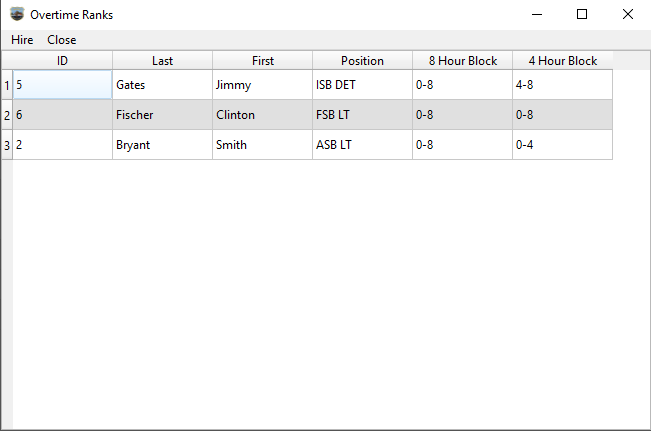
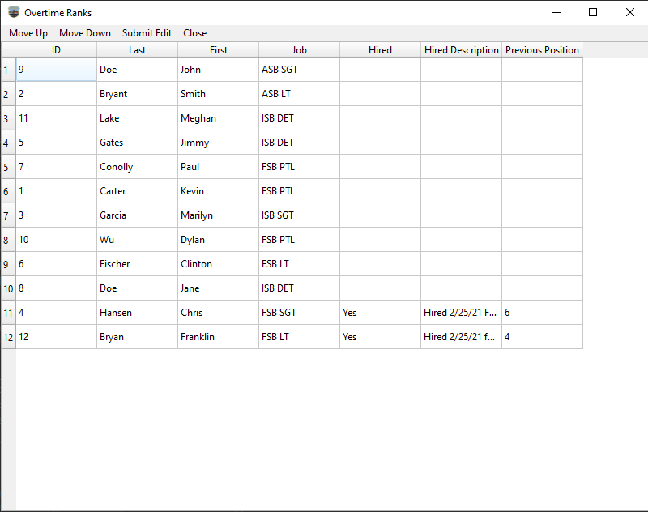
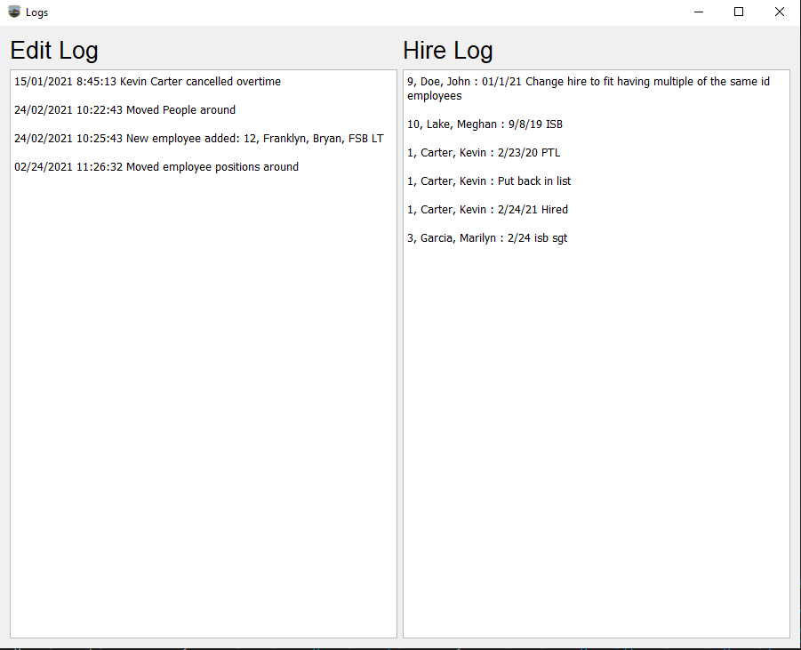

<br />
<p align="center">
  <a href="https://github.com/Jrumfelt/Overtime">
    
  </a>

  <h3 align="center">Schenectady Police Department Overtime</h3>

  <p align="center">
    Track and Hire Overtime 
    <br />
    <br />
    <a href="#installation">INSTALLATION INSTRUCTIONS</b></a>
    ·
    <a href="https://github.com/othneildrew/Best-README-Template/issues">Report Bug</a>
    ·
    <a href="https://github.com/othneildrew/Best-README-Template/issues">Request Feature</a>
  </p>
</p>

<!-- TABLE OF CONTENTS -->
## Table of Contents

- [Table of Contents](#table-of-contents)
- [About The Project](#about-the-project)
- [Demo](#demo)
  - [Home Window](#home-window)
  - [Overtime Sign Up](#overtime-sign-up)
  - [Overtime Ranks](#overtime-ranks)
  - [Edit](#edit)
  - [Logs](#logs)
- [Installation](#installation)
- [Developement](#developement)
- [Contact](#contact)

<!-- ABOUT THE PROJECT -->
## About The Project

This project was developed for the Schenectady Police Department to make tracking and hiring overtime an easier and more efficient process.

## Demo

### Home Window

Table showing all employees and whether they are hired

<p align="center">
  
</p>

<b>Schedule Overime</b> - Opens a window that allows user to sign employees up for overtime and then calculate priority.<br>
<b>Edit</b> - Opens a window for editing the employee table. Used to change details in the employee table, such as name, id, hire descriptions, etc. Useful when an employee cancels overtime and needs to be moved back to their previous position.<br>
<b>Reset</b> - Used to reset the table after the current overtime block is complete. This will add relevant information to the hired log as well as clear the hired, hired position, and previous position columns for all hired employees.<br>
<b>View Logs</b> - Opens window with logs showing all previous overtime hires and descriptions for all previous edits.<br>
<b>Add New Employee</b> - Used to add a new employee to the overtime software database.<br>
<b>Quit</b> - Quit and close the application.<br>

### Overtime Sign Up

<p align="center">
  
</p>

<b>Add Employee</b> - Used to sign an employee up for an overtime block.<br>
<b>Calculate Overtime</b> - Will calculate the priority rank of each signed up employee.<br>
<b>Withdraw Employee</b> - Used to remove a signed up employee.<br>
<b>Close</b> - Close the Sign Up window.<br>

### Overtime Ranks

<p align="center">
  
</p>

<b>Hire</b> - Used to hire a ranked employee. <br>
<b>Close</b> - Close the Overtime Ranks window.<br>

### Edit 
<p align="center">
  
</p>

<b>Move Up</b> - Moves selected row up one position.<br>
<b>Move Down</b> - Moves selected row down one position.<br>
<b>Submit Edit</b> - Save and submit the edits.<br>
<b>Close</b> - Close the window.<br>

### Logs
<p align="center">
  
</p>

## Installation

Dowload the latest version from [releases](https://github.com/Jrumfelt/Overtime/releases)
Extract from zip file and run Overtime.exe in SPDOvertime\exe.win-amd64-3.9

## Developement

You only need to follow the below instructions if you are attempting to modify this software. Otherwise, please download the latest version from the [releases](https://github.com/Jrumfelt/Overtime/releases)

The only prerequisite neeeded to use this software is [Python](https://www.python.org/downloads/)

To setup Clone the repo
```sh
git clone https://github.com/Jrumfelt/Overtime.git
```

## Contact
Joseph Rumfelt
<br>
Jrumfelt1213@gmail.com
