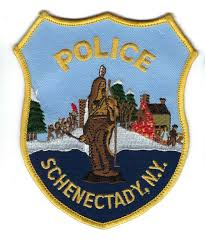

 

  

  <h3 align="center">Schenectady Police Department Overtime</h3>

  

    Track and Hire Overtime 
     
     
    <a href="https://github.com/Jrumfelt/Overtime">INSTALLATION INSTRUCTIONS</b></a>
    ·
    <a href="https://github.com/othneildrew/Best-README-Template/issues">Report Bug</a>
    ·
    <a href="https://github.com/othneildrew/Best-README-Template/issues">Request Feature</a>
  

<!-- ABOUT THE PROJECT -->
## About The Project

This project was developed for the Schenectady Police Department to make tracking and hiring overtime an easier and more efficient process. 

## Installation

Dowload the latest version from [releases](https://github.com/Jrumfelt/Overtime/releases)

## Contact
Joseph Rumfelt
 
Jrumfelt1213@gmail.com
